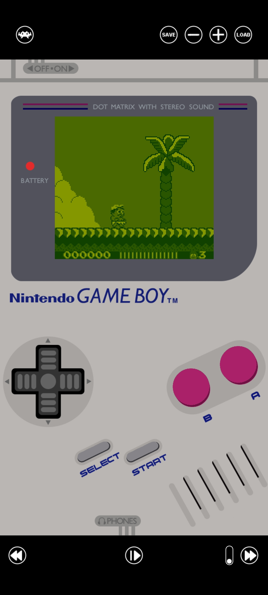

# GameBoy Overlay

# Overview

This is an updated version of my GameBoy overlay for RetroArch I made back in 2017 (<a href="https://forums.libretro.com/t/gameboy-touch-overlay/12469">Libretro Forums</a>).

I've updated it for modern 21:9 (2400x1080) screen Android devices.

To Do List:
- Remake GameBoy Color version
- Remake bigger version (Like in my Libretro forum post)
- Make GameBoy Advance (For landscape) and GBA SP (For portrait) overlays

I'm open to suggestions!

# Installation

<b>1.</b> Download latest release.

<b>2.</b> Extract and copy the <b>gb-portrait</b> folder inside: 
<i>"RetroArch/overlays/misc"</i> (Or any folder you set for overlays in RetroArch settings) and overwrite if asked.

<b>3.</b> Boot any GB or GBC game (the Gambatte core is recommended), go into the menu and change these settings:

<b>Video:</b>
- Enable fullscreen over notch in Android devices <b>"ON"</b>

<b>Video → Scaling:</b>
- Integer Scale <b>"OFF"</b>
- Aspect Ratio <b>"Custom"</b>
- Custom Aspect Ratio (X Position) <b>"221"</b>
- Custom Aspect Ratio (Y Position) <b>"1147"</b>
- Custom Aspect Ratio (Width) <b>"640 (4x)"</b>
- Custom Aspect Ratio (Height) <b>"576 (4x)"</b>
- Crop Overscan (Restart Required) <b>"ON"</b>

<b>On-Screen Display → On-Scren Overlay:</b>
- Display Overlay <b>"ON"</b>
- Auto-Scale Overlay <b>"OFF"</b>
- Overlay Preset <b>"gb"</b> (Select the <b>gb.cfg</b> file found in <b>gb-portrait</b> folder)
- Overlay Opacity <b>"1.00"</b>
- (Portrait) Overlay Aspect Adjustment <b>"-0.250"</b>
  
<b>4.</b> Go to <b>Quick Menu → Ovverides</b> and <b>Save Core Overrides</b> then restart RetroArch.
 
<b>5.</b> Play!

<b>NOTE:</b>
<b>THESE SETTINGS ARE OPTIMAL FOR 21:9, 2400x1080 RESOLUTION PHONES, FOR DIFFERENT ASPECT RATIO AND RESOLUTIONS YOU MAY HAVE TO TWEAK: CUSTOM ASPECT RATIO (X POSITION), CUSTOM ASPECT RATIO (Y POSITION), (PORTRAIT) OVERLAY ASPECT ADJUSTMENT SETTINGS.</b>
  
<b>Optional Settings:</b>
  
If you use Gambatte core i reccomend this core options:
- GB Colorization <b>"Internal"</b>
- Internal Palette <b>"GB - DMG"</b>
- Color Correction <b>"GBC Only"</b>
- Color Correction Mode <b>"Accurate"</b>
- Interframe Blending <b>"LCD Ghosting (Accurate)"</b>
- Emulated Hardware (Restart Required) <b>"Auto"</b>
- Use Official Bootloader (Restart Required) <b>"ON"</b> (If you have BIOS files)
  
I also reccomed using a <b>Video Shader</b> like <b>dot.glslp</b> found in <i>"shaders_glsl/handheld/"</i> (Or <i>"shadrs_slang/handheld/dot.slangp"</i> if you use Vulkan video driver)

# Usage

# Donation
If you like my work, please consider a small donation.

You can donate with <a href="https://paypal.me/maestrosistema?country.x=IT&locale.x=it_IT"><b>PayPal</b></a> or <a href="https://ko-fi.com/maestrosistema"><b>Ko-Fi</b></a>.

Thank You!

# Special Thanks
RetroArch Team

# Disclaimer
<b>Nintendo GameBoy</b> is a trademark of <b>Nintendo Co., Ltd</b>

<b>Android</b> is a trademark of <b>Google LLC</b>
